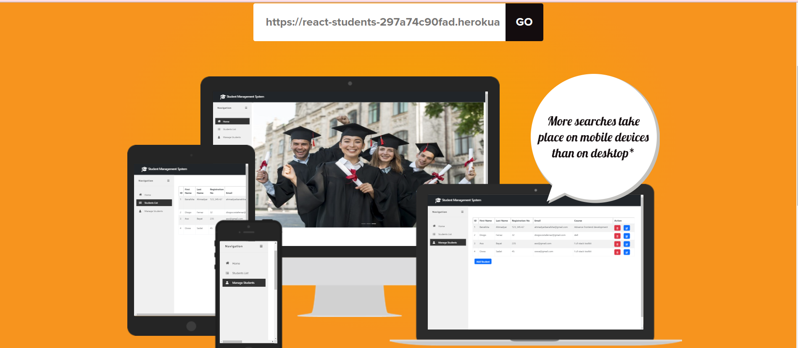

 # Students managment system 

 The student management system is an environment where all the process of the student in the institution is managed.
 This is a simple app that an admin can add students details. and have one log in page whom that has accsess on username and 
 password can use this app. why I made just log on page because of securitiy and all can get accsess on students details.
 I made this app for an specifice course , center , universaity and other learning place .

## Project description

1: Student Information Management System.<br>

2: Store the First name of the student.

3: Store the Last name of the student.

4: Store the unique Roll number for every student.

5: Store the Email Address of every student.

6: Store the courses registered by the student.

## site veiw 
[You can try it here on the live website!](https://react-students-297a74c90fad.herokuapp.com/)




# Super Admin

   Admin:
    - Username : std
    - Password : std


    

* [User Stories](#user-stories)

* [Features](#features)

* [Design](#design)
    * [Colors](#colors)
    * [Font](#font)
  
* [Technology Used](#technology-used)

* [Deployment](#deployment)

* [Credits](#credits)


## _**User Stories**_

| Category  | as      | I want to                      | so that I can                                                                                    | 
| --------- | ------- | ------------------------------ | ------------------------------------------------------------------------------------------------ |
| Log in page     | site user    | can log app         | So that can get accsess on  Students managment system  app                                                      |
| App name      | site user    | can see app name         | So that is Students managment system                                                           |
| Logo      | Site user    | can see logo in this app        | that is before app name                                                               |
| Background color of header      | Site user    | can see background color of header        | That the color is black                                                                                     |
| Content of header     | Site user | view LOGO , App name            | That is all content in header                                                                   |
| Navigation bar     | visitor | view the navgation bar         | so that is in right side of this app                                                  |
| Navigation bar content     | visitor | I can see Home, Students list , manage student and Registration page          | That is all content of navgation bar                                                      |
| Home     | site user | I can see home in navgation  | so that I added thre images here                                                                  |
| Images in home page     | site user    | can change the image that I added in home page        | the image showing like slaid show                                                                     |
| Students list     | site user    | see student list on navigation bar                  | o that on here we can see all details of students that we submit in add student bottom                                                                     |
| Student list page content ID     | site user    | see list of ID              | so that added for each students                                                              |
| Student list page content First name     | Site user    |  can see First Name of student     | so that Entered for each student                                                         |
| Student list page content Last Name     | Site user    | can see Last Name of student                     | so that That added before                                                   |
| Student list page content Registration No     | Site user    | can see registration no of students                   | that entered before                               |
| Student list page content Email  | Site user    | can see Email of each students               | so that entered before                                                      | 
| Student list page content Course  | Site user    | can see Course details of students     | that entered before                                                                     | 
| Manage students  | Site user    | can see manage students in navigation bar that is the main page                 | that add, edit,delete and store all details of students                                | 
| Manage student page content  | Site user    |  can see all details of students                | that will store in our database also                                                                   |
| Manage student page content Add student | Site user    | can add student all details of student              |  that will stored and view in student list page also                                                         | 
| Add student bottom content | Site user    | see some details of student            | that we want to enter it in this app |
| Add student page content First Name | Site user    | can add First Name of student              | that will stored and views in student list page alsot                                                         | 
| Add student page content Last Name | Site user    | can add Last Name of student              | that will stored and view in student list page also                                                         | 
| Add student page list content RegistrationNO | Site user    | can add registration no for student                | that will store and view in student list page also                                                         | 
| Add student page content Email | Site user    | can add student email              | that stored and view in student list page aslo                                                        | 
| Add student page content Course | site user    | can add any course for user that want               | that show in student list page also                                                         | 
| Add student page content Submit bottom | Site user    | can submit all details of student               | that is done for this page                                                         | 
| Manage student page content ID | Site user    | can see ID of student              |  that will add automatically                                                        | 
| Manage student page content FIst Name | Site user    | can see First name of student                | that entered before in Add student page                                                         | 
| Manage student page content Last Name | Site user    | can see Last Name of Student              |  that entered before in Add student page                                                         | 
| Manage student page content RegistrationNo | Site user    | can see registration No of studen               | that entered before in Add student page                                                         | 
| Manage student page content Email | Site user    | can see email of student               | that entered in Add student page                                                         | 
| Manage student page content Course | Site user    | can see course details              | that entered in Add student page before                                                         | 
| Manage student page content Action | Site user    | can see Action part on this details list             | that the user cant Edit or Delete any student details                                                         | 
| Manage student page Action Delete bottom | Site user    | can see delete bottom              | that can remove any student details                                                         | 
| Manage student page content Action Edit Icon | Site user    | can see edit ico              | that user can edit any information of the student                                                        | 
| Edit Icon page content | Site user    | can edit First Name of student             | that entered before in Add student page                                                         | 
| Edit Icon Last Name | Site user    | can edit last name of student               | that entered before in Add student page                                                         | 
| Edit Icon page RegistrationNO | Site user    | can edit registration no of student              | that entered before in Add student paget                                                         | 
| Edit icon page content Email | Site user    | can edit Email of student              | that entered before in Add student page                                                        | 
| Edit icon page content Course | Site user    | can edit course details             | so that entered in Add student page before                                                         | 
| At the end | Site user    | can use this app if we want to store edit delete and update any information for our students               | 👍 (:                                                       | 

* You can find the agile method to my user stories on my github repo just click [here](https://github.com/users/banafshaahmadyar/projects/22)

## _**Features**_

This is a simple app that has log in page, navgations bar , home page , students list and manage students page .

* Log in page
  


If user Inter incorect username and password then the alert massage will appear.


* Home page


* Students list page


* Manage Students page


* Add student bottom
  When site user want to add student details with clicking on this bottom new page will appear.
                                       


* New Id will appear in Manage student page


* New Id will appear in student list page


* Actions section

  

* Delete Icon


When user click on ok then one alert massage will appear.


* Update Icon
* 
  When user click on update icon one alert massage will appear then the Id will update.


  
 ## _**Design**_

  * ### _Font:_
    * I used a Google Font called Lato with regular (400) weight and add Italic style to all of the headers and normal for rest of the page.
 
  * ### _Colors:_
   * I uesed white and black colors for this app
   * But for bottom I used specifice colors like:
      * Blue for submit , add student and edit bottom.
      * Red for delete and close bottom.

## _**Technology Used**_
* [Django reast frame work](https://www.django-rest-framework.org/ "Django reast framework Project website")
    - Django was used to build the models, forms and views of the app, and was the backbone of this project.
* [React js](https://react.dev/learn "React.js Project website")
    - React was used to build the frintend of this project.
* [Bootstrap](https://getbootstrap.com/docs/5.2/getting-started/introduction/ "Bootstrap")
     - Bootstrap was used to implement the responsiveness of the site, using bootstrap classes, but also other styling such as buttons etc.
* [Cloudinary](https://cloudinary.com/ "Cloudinary")
     - Cloudinary was used as free cloud storage for images uploaded to the site through the recipe forms.
* [Google Fonts](https://fonts.google.com/ "Google Fonts")
    - Google fonts were used to import the fonts "Playfair Display" and "Lato" into the style.css file. These fonts were used throughout the project.
* [Font Awesome](https://fontawesome.com/ "FontAwesome")
     - Font Awesome was used on all pages throughout the website to import icons (e.g. social media icons) for UX purposes.
* [GitPod](https://git-scm.com/ "GitPod")
     - Git was used for version control by utilizing the GitPod terminal to commit to Git and push to GitHub.
* [GitHub](https://github.com/ "Link to GitHub")
     - GitHub was used to store the project after pushing
* [ElephantSQL](https://www.elephantsql.com/ "ElephantSQL Database")
    - ElephantSQL was used to the new database instead of the Heroku's Postgres

# Deployment
## Set up ElephantSQL as Database for this application ##

  - Go to the ElephantSQL website (https://www.elephantsql.com/) and create an account.

  - After creating an account, you will be able to create a new PostgreSQL database. Choose the plan that best fits your needs and click "Create new instance".

  - Give your database a name and select a region.

  - Once the database is created, you will see the database details page. Here, you can find the connection details for your database, including the hostname, port, database name, and username.

  - To connect to the database using the connection details provided.
## Set Up Cloudinary to host images and template files ##

  - Sign up for a Cloudinary account at https://cloudinary.com/users/register/free.

  - In the dashboard, you will see your "Cloud Name", "API Key", and "API Secret". These are saved as environment valiables in ***Heruko*** and .env local file.

  - Install the Cloudinary Python library by running the following command:

        pip install cloudinary

  - Add cloudinary in INSTALLED_APPS list in settings.py
  - Add the following code to your Django settings file to configure the Cloudinary library with your account credentials:

    ```
      STATIC_URL = '/static/'
      STATICFILES_STORAGE = 'cloudinary_storage.storage.StaticHashedCloudinaryStorage'
      STATICFILES_DIRS = [os.path.join(BASE_DIR, 'static'),]
      STATIC_ROOT = os.path.join(BASE_DIR, 'staticfiles')

      CLOUDINARY_STORAGE = {
          'CLOUD_NAME': os.environ.get('CLOUD_NAME'),
          'API_KEY': os.environ.get('API_KEY'),
          'API_SECRET': os.environ.get('API_SECRET'),
      }
      
      MEDIA_URL = '/media/'
      DEFAULT_FILE_STORAGE = 'cloudinary_storage.storage.MediaCloudinaryStorage'
    ```
  - Run the following command to apply the changes to your Django project:
    ```
        python manage.py migrate
    ```

## Deployment to Heroku ##
  - On Heroku create an account and log in.
  - Goto ci-students team
  - Click ***new*** and ***create new app***.
  - Choose a name for your app, select region and click on ***Create App***
  - Create an account and set up a PostgreSGL database in [Elephantsql](https://www.elephantsql.com/docs/index.html)
  - Under the ***Settings*** click ***Reveal Config Vars*** and all environment variables:
    - Set IP to 0.0.0.0 
    - Set PORT to 8000
    - Set DATABASE_URL
    - Set CLOUDINARY_URL 
    - Set HEROKU_HOSTNAME 
    - Set API_KEY 
    - Set API_SECRET
    - Set CLOUD_NAME
    - Set HEROKU_POSTGRESQL_ROSE_URL
    - Set SECRET_KEY 
  - In the local IDE:
    - Pip install dependencies.
    - Create ***requirements.txt*** ($ pip3 freeze --local > requirements.txt)
    - Create a ***Procfile*** (```$ echo web: gunicorn <app_name>.wsgi > Procfile```)
    - Create an evn.py file and add all your environment variables.
    - Create a .gitignore file and add your env.py files
    - Push all the changes
  
  - In Heroku ***Deploy*** Tab, the ***deployment method*** select Github,connect you gethub account if its not already connected
  - Select repository
  - Scroll down to Manual deploy and deploy branch.
  - Once the build is complete, go back to Heroku and click on ***Open App***

* Live website : [Student managment system](https://react-students-297a74c90fad.herokuapp.com/)

### HTML VALIDATION
* Html passed without errors:


### CSS VALIDATION
* No error In Css


# Credits
- I Think Therefore I Blog Tutorial in [Code Institute](https://codeinstitute.net/global/)
- [Gp Multipurpose HTML and Bootstrap Template](https://bootstrapmade.com/gp-free-multipurpose-html-bootstrap-template/)
- [Stackoverflow website](https://stackoverflow.com/)

### Automated:

- used the msw library to mock user and logout endpoints
- tested the NavBar component:
  - renders without a problem
  - renders the link to a user profile for a logged in user
  - renders the sign in and sign up buttons again on logout

### Manual:

- every other feature tested extensively

## Libraries, contexts and hooks:

- react-infinite-scroll-component
  - introduced to replace traditional pagination with lazy loading instead of pagination to make the application more performant and seem more snappy/ engaging
- react-bootstrap:
  - introduced
- contexts:
  - CurrentUserContext exposes the user state to the entire app. Relevant components can subscribe to its changes
  - ProfileDataContext exposes the profile state to the entire app. Enables the PopularProfiles component to be in sync with the ProfilePage contents
- custom hooks written to reduce repeatable state logic:
  - useClickOutsideToggle: enable toggle on the burger menu
  - useRedirect: enable redirect for users who are either logged in or logged out, depending on the use case

---
